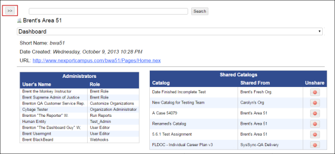

# View and Search for an Organization or a Group

## **To view an organization or a group**

<mark style="color:blue;">**Step 1:**</mark> Click <mark style="color:blue;">**Administration**</mark> <mark style="color:blue;">></mark> <mark style="color:blue;">**Manage Campus**</mark><mark style="color:blue;">.</mark>

<mark style="color:blue;">**Step 2:**</mark> The <mark style="color:blue;">**Manage Campus**</mark> page is displayed.

<mark style="color:blue;">**Step 3:**</mark> In the upper left corner, click the unfold  button.

<mark style="color:blue;">**Step 4:**</mark> A list of existing organizations or groups in the NexPort Campus is displayed. In the <mark style="color:blue;">**Recent**</mark> section, you can view the recently viewed organization or group.

## **To search an organization or a group**

<mark style="color:blue;">**Step 1:**</mark> Click <mark style="color:blue;">**Administration**</mark> <mark style="color:blue;">></mark> <mark style="color:blue;">**Manage Campus**</mark>.

<mark style="color:blue;">**Step 2:**</mark> The <mark style="color:blue;">**Manage Campus**</mark> page is displayed.

<mark style="color:blue;">**Step 3:**</mark> In the <mark style="color:blue;">**Search**</mark> box, type the first few characters of an organization or a group that you need to search.

<mark style="color:blue;">**Step 4:**</mark> Click <mark style="color:blue;">**Search**</mark>.

<mark style="color:blue;">**Step 5:**</mark> NexPort Campus populates matching results.

#### © NexPort Solutions 2022. All Rights Reserved.
