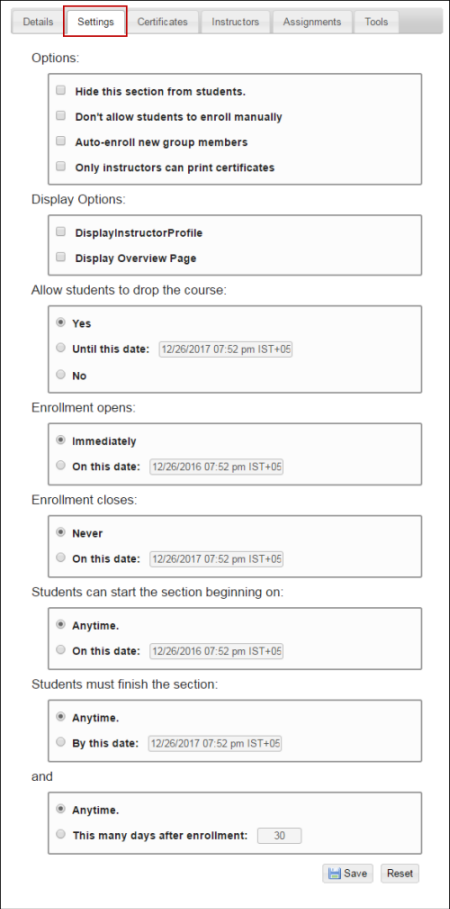

# Configure Section Settings

## **To configure section settings**

Step 1: Click the **Settings** tab.

Step 2: The **Settings** page is displayed.

Step 3: In the **Options** area, do the following:

> Select the **Hide this section from students** check box to not allow for not allowing the students to see the section in their enrollment list.
>
> Select the **Don't allow students to enroll manually** check box to disallow students from enrolling in the section manually.
>
> Select the **Auto-enroll new group members** check box to automatically enroll a student in the section when a student is given, a membership in a group where the section is shared.
>
> Select the **Only instructors can print certificates** check box to grant the instructors the rights to print the certificates. Students are not able to view their certificates through the **My Training** tab.

Step 4: In the **Display Options** area, do the following:

> Select the **Display Instructor Profile** check box to let the instructor profile be displayed in the student’s classroom.
>
> Select the **Display Overview Page** check box to let the overview page be displayed in the student's classroom.

Step 5: In the **Allow students to drop the course** area, do one of the following:

> Click **Yes**, to allow students to drop any progress in the section.
>
> **The**  **icon is visible only when the Allow students to drop the course is set to Yes.**
>
> For more information about allowing students to drop the course, see Enrollments in NexPort Campus Student Help.
>
> Click **Until this date**, and then select a date to allow students to drop progress in the section up to a certain date.
>
> Click **No**, to disallow students from dropping progress in the section.

Step 6: In the **Enrollment opens** area, do one of the following:

> Click **Immediately**, to open the enrollments for the students.
>
> Click **On this date**, to set the date that students are allowed to enroll in the section.

Step 7: In the **Enrollment closes** area, do one of the following:

> Click **Never**, to allow students to enroll in the section.
>
> Click **On this Date**, to set an end date for when students can enroll in the section.

Step 8: In the **Students can start the section beginning on** area, do one of the following:

> Click **Anytime**, to let the students to start the section as soon as they are enrolled.
>
> Click **On this Date**, to set the start date for the section.

Step 9: In the **Students must finish the section** area, do one of the following:

> Click **Anytime**, to let students complete the section anytime.
>
> Click **By this Date**, to set the end date to complete the section.

Step 10: In the **and** area, do one of the following:

> Click **Anytime**, to let students complete the section anytime.
>
> Click **This many days after enrollment**, to set the number of days the student has to complete the section. When the student is enrolled, the student must complete the section within the specified number of days after enrollment.

Step 11: Click **Save**.

#### © NexPort Solutions 2022. All Rights Reserved.
