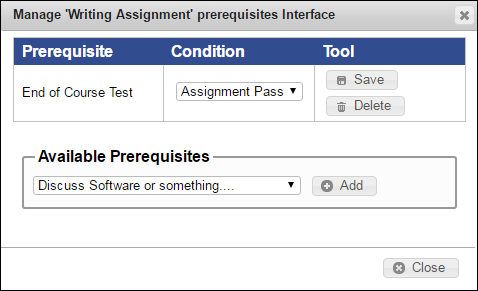

# Manage Assignment

You can add, modify, and delete an assignment and assignment heading. You can also add assignment headings to group assignments under and set a section mastery which allows a student to pass a section even if they have failed individual assignments. The total combined weighted points that a student earns on all assignments in a section must be at least the section mastery score for the student to pass the section.

The Instructor can assign various types of assignments to the students. For more information about various types of assignments:


[types-of-assignments](../types-of-assignments/)


## **To add an assignment**

Step 1: Click the **Assignments** tab.

1. The **Assignments** page is displayed.
2. \\
3. In the **Edit Assignments** area, do the following:
   * Click **Add Heading**, to add heading to an assignment.
   * Select the **Use section mastery** check box, to allow students to pass a section even if they have failed in the individual assignments.
   * Click **Add an assignment**, enter the assignment type.
4. The **New \<AssignmentTypeName> Assignment** dialog box is displayed.
5. Note:
6. The values and fields in the **New \<AssignmentTypeName> Assignment** dialog box vary from assignment to assignment.
7. \\
8. Type the values, and then click **Save**.
9. The new assignment is saved.
10. In the **Assignments** page, under the **Assignment** section, the new assignment is added.
11. \\

## To modify assignment details

1. Click the **Assignments** tab.
2. The **Assignments** page is displayed.
3. \\
4. In the **Assignment** section, click the  icon corresponding to the assignment that you need to modify.
5. Modify the values and fields.
6. Click **Save**.
7. The assignment details are updated and saved.

To set prerequisites:

Note:

Prerequisites ensure that a student cannot access an assignment until they have completed all of its prerequisite assignments.

1. Click the **Assignments** tab.
2. The **Assignments** page is displayed.
3. \\
4. In the **Assignment** section, click **Prerequisites** next to the assignment that you need to add a prerequisite.
5. **The Manage \<AssignmentName> prerequisites Interface** dialog box is displayed.
6. \\
7. In the **Available Prerequisites** area, click to add the prerequisites, and then apply assignment conditions.
8. Click **Save**.
9. The prerequisites assigned for the selected assignment are saved.
10. Click **Close**, to close the **Manage \<AssignmentName> prerequisites Interface** dialog box.

## **To delete an assignment**

1. Click the **Assignments** tab.
2. The **Assignments** page is displayed.
3. \\
4. In the **Assignment** section, click the .png>) icon next to the assignment that you need to delete.
5. A **Delete Assignment** dialog box with the confirmation message, “Are you sure you want to delete this assignment?” is displayed.
6. Click **Delete**.
7. The selected assignment is deleted from the NexPort Campus.
8. Note:
9. Deleting assignments after a student has already enrolled in the section and started the assignment can cause any progress to be lost.

#### © NexPort Solutions 2022. All Rights Reserved.
