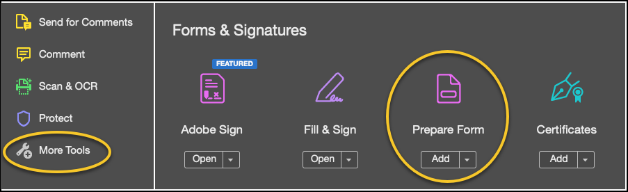
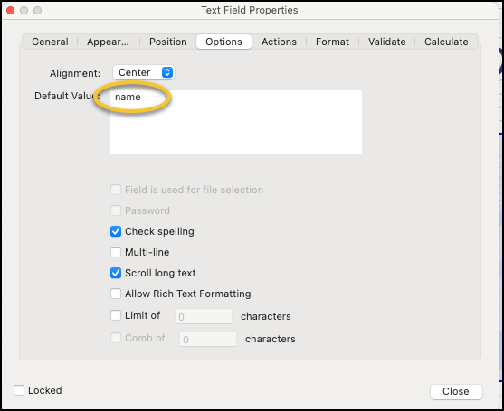

# Creating a PDF Certificate

<mark style="color:blue;">**Step 1:**</mark>  Gather desired certificate fields from:


[certificate-pdf-properties.md](certificate-pdf-properties.md)


<mark style="color:blue;">**Step 2:**</mark>  Create desired certificate layout in any text editor i.e. Word, Excel, or PDF file format, then save it.

<mark style="color:blue;">**Step 3:**</mark>  Open <mark style="color:blue;">**Adobe Acrobat Pro.**</mark>

<mark style="color:blue;">**Step 4:**</mark>  Select <mark style="color:blue;">**File > Open**</mark> and select the certificate file.

<mark style="color:blue;">**Step 5:**</mark>  Select the <mark style="color:blue;">**More Tools**</mark> option and then select <mark style="color:blue;">**Prepare Form.**</mark>

<mark style="color:blue;">**Step 6:**</mark>  Click <mark style="color:blue;">**Start**</mark> on the next screen.

<mark style="color:blue;">**Step 7:**</mark>  Select <mark style="color:blue;">**Add Text Field**</mark> and place it as so desired on the form.

<mark style="color:blue;">**Step 8:**</mark>  Enter the certificate <mark style="color:blue;">**field variable name**</mark> and select <mark style="color:blue;">**All Properties**</mark> link

<mark style="color:blue;">**Step 9:**</mark>  Select the <mark style="color:blue;">**Options**</mark> tab, enter the certificate field variable name within the <mark style="color:blue;">**Default Value:**</mark> text field, and click <mark style="color:blue;">**Close**</mark>

<mark style="color:blue;">**Step 10:**</mark>  Repeat steps <mark style="color:blue;">**7 through 9**</mark> for all certificate fields.

<mark style="color:blue;">**Step 11:**</mark>  Save the file as a <mark style="color:blue;">**PDF.**</mark>

#### © NexPort Solutions 2022. All Rights Reserved.
