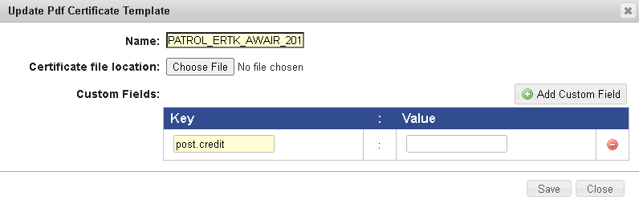

# Modify Certificate Properties

| Icon                                                                                                                             | Action or Description               |
| -------------------------------------------------------------------------------------------------------------------------------- | ----------------------------------- |
|     | Click to view a sample certificate. |
|  | Click to download a certificate.    |
|    | Click to delete the certificate.    |

## To Modify Certificate Properties

<mark style="color:blue;">**Step 1:**</mark>  Click <mark style="color:blue;">**Administration**</mark> <mark style="color:blue;"></mark><mark style="color:blue;">></mark> <mark style="color:blue;"></mark><mark style="color:blue;">**Manage Campus**</mark> <mark style="color:blue;"></mark><mark style="color:blue;">></mark> <mark style="color:blue;"></mark><mark style="color:blue;">**Organization Tools**</mark> <mark style="color:blue;"></mark><mark style="color:blue;">></mark> <mark style="color:blue;"></mark><mark style="color:blue;">**Certificates**</mark>.

<mark style="color:blue;">**Step 2:**</mark>  The <mark style="color:blue;">**Certificates Templates**</mark> tab is displayed.

<mark style="color:blue;">**Step 3:**</mark>  Select a certificate template that you need to modify.

.png>)

<mark style="color:blue;">**Step 4:**</mark>  The <mark style="color:blue;">**Update (HTML/PDF) Certificate Template**</mark> dialog is displayed.

.png>)

<mark style="color:blue;">**Step 5:**</mark>  Modify the values on the fields.

<mark style="color:blue;">**Step 6:**</mark>  Click <mark style="color:blue;">**Save**</mark> and **** the certificate details are updated and saved.

#### &#x20;© NexPort Solutions 2022. All Rights Reserved.
