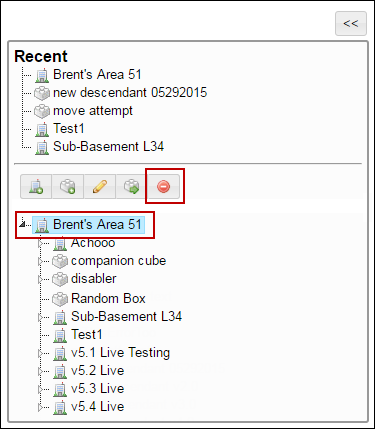

# Delete a Courseware

## **To delete a courseware**

<mark style="color:blue;">**Step 1:**</mark> Click <mark style="color:blue;">**Administration**</mark> <mark style="color:blue;">></mark> <mark style="color:blue;">**Manage Campus**</mark> <mark style="color:blue;">></mark> <mark style="color:blue;">**Organization Tools**</mark> <mark style="color:blue;">></mark> <mark style="color:blue;">**Courseware**</mark><mark style="color:blue;">.</mark>

<mark style="color:blue;">**Step 2:**</mark> The <mark style="color:blue;">**Owned**</mark> tab is displayed.

<mark style="color:blue;">**Step 3:**</mark> In the <mark style="color:blue;">**Select**</mark> column, click the  icon next to the courseware that you need to delete.


In the **Select** column, if the icon is disabled, it means the students are currently enrolled for that courseware.


<mark style="color:blue;">**Step 4:**</mark> Click <mark style="color:blue;">**Delete Selection**</mark><mark style="color:blue;">.</mark> A confirmation dialog box is displayed with the _<mark style="color:red;background-color:yellow;">“Are you sure you want to delete \<courseware name>?”</mark>_ message.

<mark style="color:blue;">**Step 5:**</mark> Click <mark style="color:blue;">**OK**</mark><mark style="color:blue;">.</mark> The selected owned courseware is deleted.

#### © NexPort Solutions 2022. All Rights Reserved.
