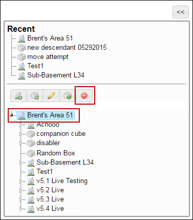

# Delete a Question Bank

## **To delete a question bank**

<mark style="color:blue;">**Step 1:**</mark> Click <mark style="color:blue;">**Administration**</mark> <mark style="color:blue;">></mark> <mark style="color:blue;">**Manage Campus**</mark> <mark style="color:blue;">></mark> <mark style="color:blue;">**Organization Tools**</mark> <mark style="color:blue;">></mark> <mark style="color:blue;">**Question Banks**</mark><mark style="color:blue;">.</mark>

<mark style="color:blue;">**Step 2:**</mark> The <mark style="color:blue;">**Question Banks**</mark> page is displayed.

<mark style="color:blue;">**Step 3:**</mark> Click the  icon next to the question bank that you need to remove from the <mark style="color:blue;">**Question Bank**</mark> page.

<mark style="color:blue;">**Step 4:**</mark> A confirmation dialog box is displayed with the _<mark style="color:red;background-color:yellow;">“Are you sure you want to delete \<QuestionBank>?”</mark>_ message.

<mark style="color:blue;">**Step 5:**</mark> Click <mark style="color:blue;">**OK**</mark><mark style="color:blue;">.</mark> The selected question bank is deleted.

#### © NexPort Solutions 2022. All Rights Reserved.
