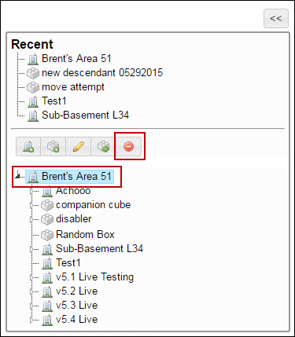

# Manage Question details

## To add a question

<mark style="color:blue;">**Step 1:**</mark> Click the <mark style="color:blue;">**Questions**</mark> tab. The <mark style="color:blue;">**Questions**</mark> page is displayed with the list of questions.

<mark style="color:blue;">**Step 2:**</mark> Click <mark style="color:blue;">**Add**</mark><mark style="color:blue;">,</mark> to add a question to the question bank. The <mark style="color:blue;">**Edit Question**</mark> tab is displayed.

<mark style="color:blue;">**Step 3**</mark>: In the <mark style="color:blue;">**Question Id**</mark> box, type the question number.


Organizations can provide any number. The question identification number is used to track questions using organization specific identifiers.


<mark style="color:blue;">**Step 4:**</mark> In the <mark style="color:blue;">**Questions**</mark> area, provide the required information.

> _The following table provides explanation for the user inputs required for the various sections and their respective fields._

| Section                                                   | Field                                                                                                                                                                                                                                                                                                                                                                                                                                                                                   | Action or Description                       |
| --------------------------------------------------------- | --------------------------------------------------------------------------------------------------------------------------------------------------------------------------------------------------------------------------------------------------------------------------------------------------------------------------------------------------------------------------------------------------------------------------------------------------------------------------------------- | ------------------------------------------- |
| <mark style="color:blue;">**Question**</mark>             | Text                                                                                                                                                                                                                                                                                                                                                                                                                                                                                    | In the Rich Text Editor, type the question. |
| <mark style="color:blue;">**Type**</mark>                 | In the <mark style="color:blue;">**Type**</mark> list, select the question type (Single Select, Multi-Select, or Five Point Scale).                                                                                                                                                                                                                                                                                                                                                     |                                             |
| <mark style="color:blue;">**Sequencing**</mark>           | 
Select one of the following:
<ul><li><mark style="color:blue;"><strong>Random</strong>:</mark> The question is randomly generated when a test is administered.</li><li><mark style="color:blue;"><strong>Ordered</strong>:</mark> The question is sequentially generated when a test is administered.</li></ul>                                                                                                                                                                   |                                             |
| <mark style="color:blue;">**Options**</mark>              | 
Click <mark style="color:blue;"><strong>New Option</strong></mark> to add an option.

A section to type the option and its details are displayed.

Note:

This is the section to add the options for the question and the feedback responses when the student exercises these options.

For example, to the question: “Which is the deepest ocean?”, the options provided can be the following: “Arctic ocean”, “Pacific ocean”, “Indian ocean”, and others.
 |                                             |
| <mark style="color:blue;">**Option Id**</mark>            | 
In the <mark style="color:blue;"><strong>Option Id</strong></mark> box, type the unique identification number of the option.

For example, 1 can be the option ID for Arctic ocean.
                                                                                                                                                                                                                                                                                         |                                             |
| <mark style="color:blue;">**Rich Text Editor**</mark>     | 
In the Rich Text Editor, type the option.

For example, type “Arctic Ocean”.
                                                                                                                                                                                                                                                                                                                                                                                                |                                             |
| <mark style="color:blue;">**Correct or Incorrect**</mark> | 
This is a toggle button to indicate whether the option is the correct answer.

Note:

For multi-select type of questions where more than one option may be correct, ensure that all such options are tagged as Correct.
                                                                                                                                                                                                                                                |                                             |
| <mark style="color:blue;">**Remove**</mark>               | Click <mark style="color:blue;">**Remove**</mark> to delete the option.                                                                                                                                                                                                                                                                                                                                                                                                                 |                                             |
| <mark style="color:blue;">**Feedback**</mark>             | 
In the Rich Text Editor, type the feedback response.

For example, if the student has selected the right answer, the response can be “That’s correct!”.
                                                                                                                                                                                                                                                                                                                     |                                             |

<mark style="color:blue;">**Step 5:**</mark> In the <mark style="color:blue;">**Open Ended Question**</mark> area, type the open-ended questions. Answers to such questions can be subjective, descriptive and/or factual, where the students are required to apply their thought process and provide answers.

> _The following table provides information related to the open ended question details and their respective fields._

| Section                                                  | Field                                                                                                                                                                                                         | Action or Description                       |
| -------------------------------------------------------- | ------------------------------------------------------------------------------------------------------------------------------------------------------------------------------------------------------------- | ------------------------------------------- |
| <mark style="color:blue;">**Open Ended Question**</mark> | Text                                                                                                                                                                                                          | In the Rich Text Editor, type the question. |
| <mark style="color:blue;">**Required**</mark>            | Select the check box to mark the question as mandatory when the questions are being generated randomly. Students are required to answer the open ended question in order to receive credit for this question. |                                             |

<mark style="color:blue;">**Step 6:**</mark> Click <mark style="color:blue;">**Apply**</mark> to save the details after adding the question and the options.

<mark style="color:blue;">**Step 7:**</mark> Click <mark style="color:blue;">**OK**</mark> to save the question and revert to the <mark style="color:blue;">**Questions**</mark> tab.


The <mark style="color:blue;">**Editing \<question bank name>**</mark> page is displayed. The question is added to the question bank.


## Modify question details 

You can update or modify question details.

<mark style="color:blue;">**Step 1:**</mark> Click the <mark style="color:blue;">**Questions**</mark> tab. The <mark style="color:blue;">**Questions**</mark> page is displayed.

<mark style="color:blue;">**Step 2:**</mark> Click the  icon, next to the question that you need to modify. The <mark style="color:blue;">**Edit Question**</mark> tab is displayed.

<mark style="color:blue;">**Step 3:**</mark> Modify the values in the <mark style="color:blue;">**Question**</mark> area and <mark style="color:blue;">**Open Ended Question**</mark> area.

<mark style="color:blue;">**Step 4:**</mark> Click <mark style="color:blue;">**Apply**</mark> to save the details after adding the question and the options.

<mark style="color:blue;">**Step 5:**</mark> Click <mark style="color:blue;">**OK**</mark><mark style="color:blue;">.</mark> The question details are updated and saved.

## Delete questions 

You can delete questions from the question bank that are no longer relevant.

<mark style="color:blue;">**Step 1:**</mark> Click the <mark style="color:blue;">**Questions**</mark> tab. The <mark style="color:blue;">**Questions**</mark> page is displayed.

<mark style="color:blue;">**Step 2:**</mark> Click the  icon next to the questions that you need to remove. A confirmation dialog box is displayed with the _<mark style="color:red;background-color:yellow;">“Are you sure this is what you want?”</mark>_ message.

<mark style="color:blue;">**Step 3:**</mark> Click <mark style="color:blue;">**OK**</mark><mark style="color:blue;">.</mark> The selected questions are deleted from the question bank.

#### © NexPort Solutions 2022. All Rights Reserved.
