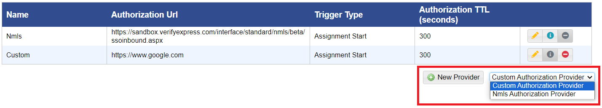
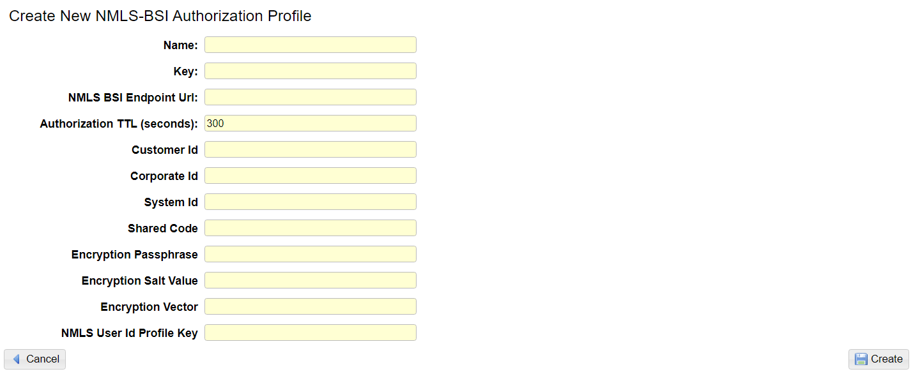

# Add an Nmls Authorization Provider

## **To add an nmls authorization provider**

<mark style="color:blue;">**Step 1:**</mark> Click <mark style="color:blue;">**Administration**</mark> > <mark style="color:blue;">**Manage Campus**</mark> > <mark style="color:blue;">**Organization Tools**</mark> > <mark style="color:blue;">**Remote Authorization Providers**</mark>.

> The <mark style="color:blue;">**Remote Authorization Providers**</mark> page is displayed.

<mark style="color:blue;">**Step 2:**</mark> Select Nmls Authorization Provider from the dropdown and click <mark style="color:blue;">**New Provider**</mark><mark style="color:blue;">.</mark>

> The <mark style="color:blue;">**Create New NMLS-BSI Authorization Profile**</mark> form is displayed.

<figure><figcaption></figcaption></figure>

<mark style="color:blue;">**Step 3:**</mark> In the <mark style="color:blue;">**Name**</mark> box, type the name of the authorization provider.

<mark style="color:blue;">**Step 4:**</mark> In the <mark style="color:blue;">**Key**</mark> box, type the unique key for your authorization provider. This is used in the callback url that you will provide to BioSig to complete the integration.

<mark style="color:blue;">**Step 5:**</mark> In the <mark style="color:blue;">**Customer Id**</mark> box, type your unique customer id. Eg: nmls\_example

<mark style="color:blue;">**Step 6:**</mark> In the <mark style="color:blue;">**Corporate Id**</mark> box, type your NMLS provider’s corporate NMLS ID. Eg: NMLS#14001234.

<mark style="color:blue;">**Step 7:**</mark> In the <mark style="color:blue;">**System Id**</mark> box, type the unique identifier assigned to your primary system. Eg: nmls.

<mark style="color:blue;">**Step 8:**</mark> In the <mark style="color:blue;">**Shared Code**</mark> box, type shared secret code assignment by BioSig. Eg: pAs$w0rD!

<mark style="color:blue;">**Step 9:**</mark> In the <mark style="color:blue;">**Encryption Passphrase**</mark>, <mark style="color:blue;">**Encryption Salt Value**</mark><mark style="color:blue;">,</mark> and <mark style="color:blue;">**Encryption Vector**</mark> boxes, type encryption information given to you by BioSig.

<mark style="color:blue;">**Step 10:**</mark> In the <mark style="color:blue;">**NMLS User Id Profile Key**</mark> box, type the key of the profile field that you will use to store your users' Nmls user id.

<mark style="color:blue;">**Step 11:**</mark> Click the <mark style="color:blue;">**Create**</mark> button. A green <mark style="color:blue;">**Saved**</mark> alert will appear. Click the <mark style="color:blue;">**Back**</mark> button to return to the provider listing.
