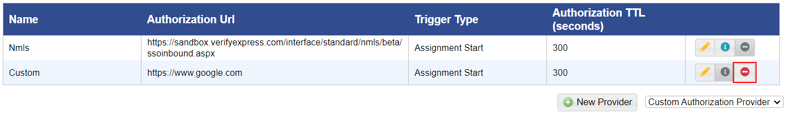

# Delete an Authorization Provider

## **To delete the authorization provider**

<mark style="color:blue;">**Step 1:**</mark> Click <mark style="color:blue;">**Administration**</mark> > <mark style="color:blue;">**Manage Campus**</mark> > <mark style="color:blue;">**Organization Tools**</mark> > <mark style="color:blue;">**Remote Authorization Providers**</mark>.

> The <mark style="color:blue;">**Remote Authorization Providers**</mark> page is displayed.

<mark style="color:blue;">**Step 2:**</mark> Click the delete icon for the given authorization provider.

> The authorization provider is deleted.
