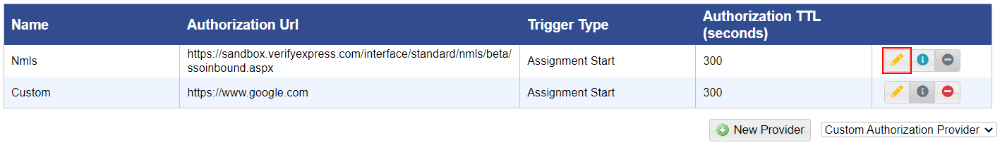

# Modify an Authorization Provider

## **To modify a custom authorization provider**

<mark style="color:blue;">**Step 1:**</mark> Click <mark style="color:blue;">**Administration**</mark> > <mark style="color:blue;">**Manage Campus**</mark> > <mark style="color:blue;">**Organization Tools**</mark> > <mark style="color:blue;">**Remote Authorization Providers**</mark>.

> The <mark style="color:blue;">**Remote Authorization Providers**</mark> page is displayed.

<mark style="color:blue;">**Step 2:**</mark> Click the pencil icon for the given authorization provider.

> The <mark style="color:blue;">**Edit Authorization Provider**</mark> form is displayed.

<mark style="color:blue;">**Step 3:**</mark> Edit the authorization provider details.

<mark style="color:blue;">**Step 4:**</mark> Click the <mark style="color:blue;">**Save**</mark> button. A green <mark style="color:blue;">**Saved**</mark> alert will appear. Click the <mark style="color:blue;">**Back**</mark> button to return to the provider listing.
