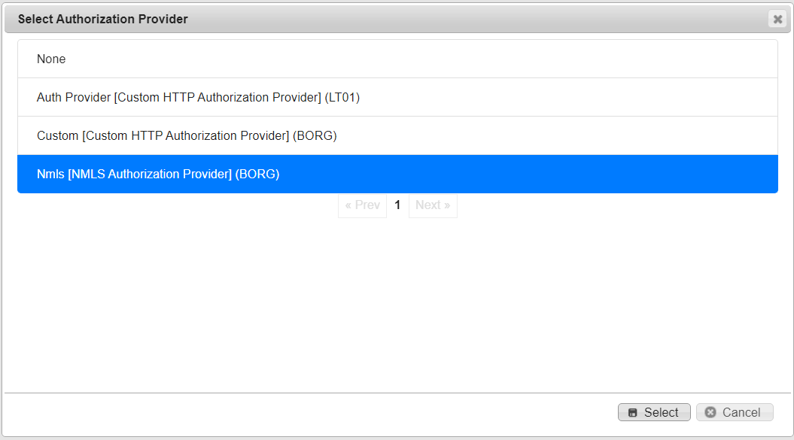

# Use an Authorization Provider in a Section

## **To use an nmls authorization provider to a section**

<mark style="color:blue;">**Step 1:**</mark> Click <mark style="color:blue;">**Administration**</mark> > <mark style="color:blue;">**Manage Campus**</mark> > <mark style="color:blue;">**Group Tools**</mark> > <mark style="color:blue;">**Sections**</mark>.

> The <mark style="color:blue;">**Sections**</mark> page is displayed.

<mark style="color:blue;">**Step 2:**</mark> Click the pencil icon next to your section.

> The <mark style="color:blue;">**Edit Section**</mark> form is displayed.

<figure><figcaption></figcaption></figure>

<mark style="color:blue;">**Step 3:**</mark> In the <mark style="color:blue;">**Settings**</mark> tab, scroll down to the <mark style="color:blue;">**Authorization Provider**</mark> section.

<figure><figcaption></figcaption></figure>

<mark style="color:blue;">**Step 4:**</mark> Select the arrow down button next to the <mark style="color:blue;">**Authorization Provider**</mark> select box.

> The <mark style="color:blue;">**Select Authorization Provider**</mark> dialog is displayed. It includes any authorization providers in your group ancestor tree that you have permission to view.

<figure><figcaption></figcaption></figure>

<mark style="color:blue;">**Step 5:**</mark> Select the desired authorization provider and click the <mark style="color:blue;">**Select**</mark> button.

> The <mark style="color:blue;">**Select Authorization Provider**</mark> dialog is closed and the provider is displayed in the select box. Note: This is not persisted until you click the <mark style="color:blue;">**Save**</mark> button.

