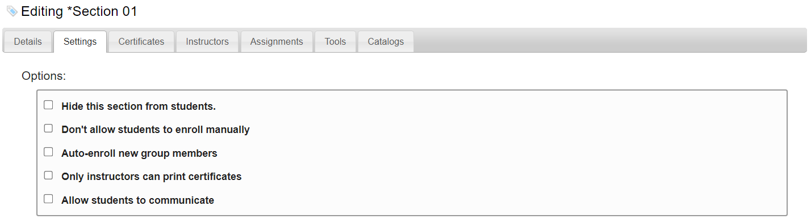
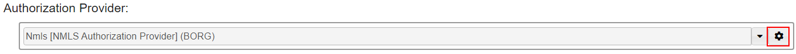
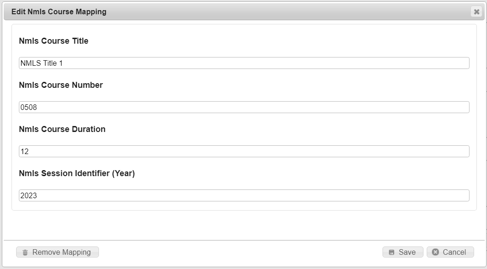
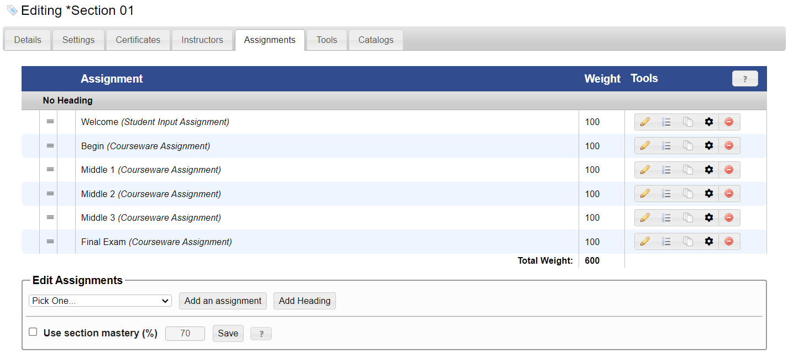

# Map a Section to an Nmls Course

## **To map an nmls course to a section**

<mark style="color:blue;">**Step 1:**</mark> Click <mark style="color:blue;">**Administration**</mark> > <mark style="color:blue;">**Manage Campus**</mark> > <mark style="color:blue;">**Group Tools**</mark> > <mark style="color:blue;">**Sections**</mark>.

> The <mark style="color:blue;">**Sections**</mark> page is displayed.

<mark style="color:blue;">**Step 2:**</mark> Click the pencil icon next to your section.

> The <mark style="color:blue;">**Edit Section**</mark> form is displayed.

<figure><figcaption></figcaption></figure>

<mark style="color:blue;">**Step 3:**</mark> In the <mark style="color:blue;">**Settings**</mark> tab, scroll down to the <mark style="color:blue;">**Authorization Provider**</mark> section.

<figure><figcaption></figcaption></figure>

<mark style="color:blue;">**Step 4:**</mark> After setting up your authorization provider, select the gear button next to the <mark style="color:blue;">**Authorization Provider**</mark> select box.

> The <mark style="color:blue;">**Edit Nmls Course Mapping**</mark> dialog is displayed.

<figure><figcaption></figcaption></figure>

<mark style="color:blue;">**Step 5:**</mark> In the <mark style="color:blue;">**Nmls Course Title**</mark> box, type the title of your Nmls course.

<mark style="color:blue;">**Step 6:**</mark> In the <mark style="color:blue;">**Nmls Course Number**</mark> box, type the number of your Nmls course. This is a 4-7 digit number.

<mark style="color:blue;">**Step 7:**</mark> In the <mark style="color:blue;">**Nmls Course Duration**</mark> box, type the number hours in your Nmls course. This can be from 1 - 12.

<mark style="color:blue;">**Step 8:**</mark> In the <mark style="color:blue;">**Nmls Session Identifier**</mark> box, type the year your Nmls course is valid.&#x20;

<mark style="color:blue;">**Step 9:**</mark> Click the <mark style="color:blue;">**Save**</mark> button.&#x20;

> The <mark style="color:blue;">**Edit Nmls Course Mapping**</mark> dialog is closed.

At any point that you no longer want your section to be mapped to an Nmls course, click the <mark style="color:blue;">**Remove Mapping**</mark> button.&#x20;

## **Mapping each assignment in a section to an Nmls Course segment**

<mark style="color:blue;">**Step 1:**</mark> Click <mark style="color:blue;">**Administration**</mark> > <mark style="color:blue;">**Manage Campus**</mark> > <mark style="color:blue;">**Group Tools**</mark> > <mark style="color:blue;">**Sections**</mark>.

> The <mark style="color:blue;">**Sections**</mark> page is displayed.

<mark style="color:blue;">**Step 2:**</mark> Click the pencil icon next to your section. Select the <mark style="color:blue;">**Assignments**</mark> tab.

> The assignment listing is displayed.

<figure><figcaption></figcaption></figure>

<mark style="color:blue;">**Step 3:**</mark> Click the gear button next to the assignment.

> The <mark style="color:blue;">**Manage Nmls BioSig Mapping**</mark> dialog is displayed.

<figure><figcaption></figcaption></figure>

<mark style="color:blue;">**Step 4:**</mark> Select the appropriate <mark style="color:blue;">**BioSig Identifier**</mark> from the dropdown.

* Begin - This is the first assignment, which accounts for about 2-3 hours of the course. This can only be used once in the section.
* Middle - An assignment in the middle, which accounts for 2-3 hours of the course. There can be three of these in the section.
* Final Exam - The final exam for the Nmls Course. This can only be used once in the section.
* None - This means that the BioSig interface will not be displayed for the given assignment.

<mark style="color:blue;">**Step 5:**</mark> If you have selected Middle as the <mark style="color:blue;">**BioSig Identifier**</mark> value, type the Middle Order in the <mark style="color:blue;">**BioSig Identifier Order**</mark> box. This can be from 1 to 3.

<figure><figcaption></figcaption></figure>

<mark style="color:blue;">**Step 6:**</mark> Click the <mark style="color:blue;">**Save**</mark> button.

> The dialog is closed, and the assignment listing is displayed with the BioSig mappings indicated in bold.

<figure><figcaption></figcaption></figure>

At any point that you no longer want your assignment to trigger the BioSig interface, click the <mark style="color:blue;">**Remove Mapping**</mark> button.&#x20;
