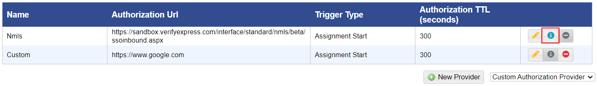

# View Nmls Authorization Provider Integration Details

## **To view authorization provider integration details**

<mark style="color:blue;">**Step 1:**</mark> Click <mark style="color:blue;">**Administration**</mark> > <mark style="color:blue;">**Manage Campus**</mark> > <mark style="color:blue;">**Organization Tools**</mark> > <mark style="color:blue;">**Remote Authorization Providers**</mark>.

> The <mark style="color:blue;">**Remote Authorization Providers**</mark> page is displayed.

<mark style="color:blue;">**Step 2:**</mark> Click the info icon for the given Nmls authorization provider.

> The <mark style="color:blue;">**Nmls/BioSig Integration Details**</mark> dialog is displayed.

<figure><figcaption></figcaption></figure>

<mark style="color:blue;">**Step 3:**</mark> Copy the url displayed and share it with BioSig.
