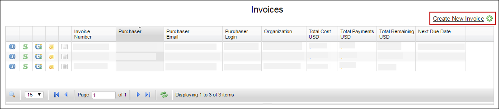
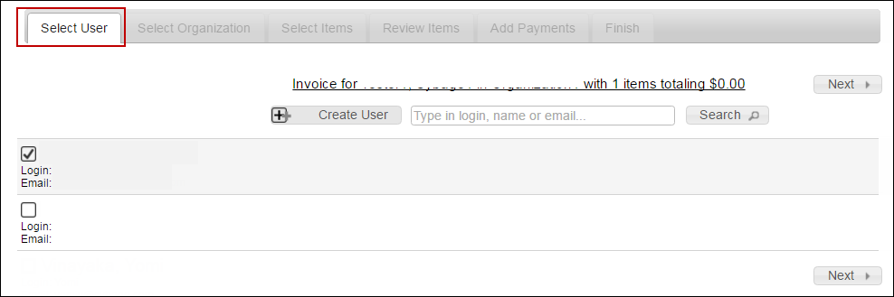
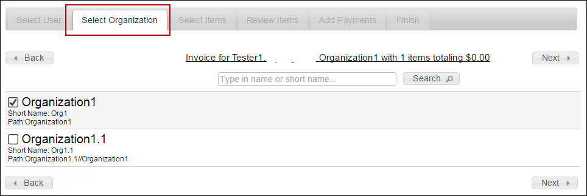
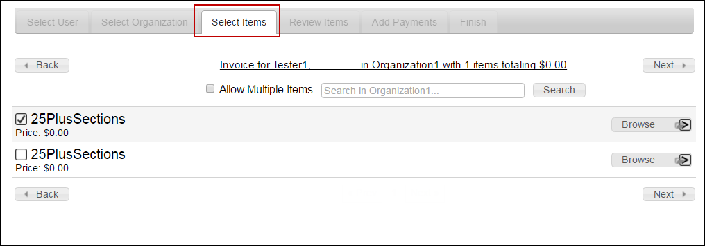
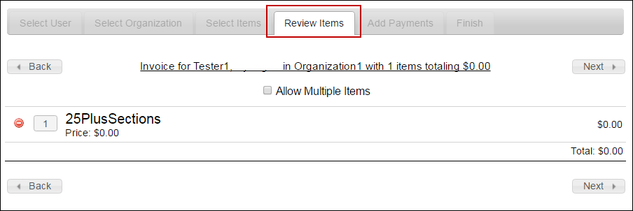
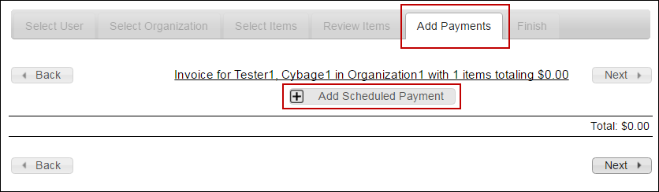
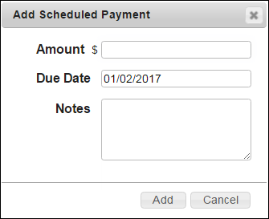
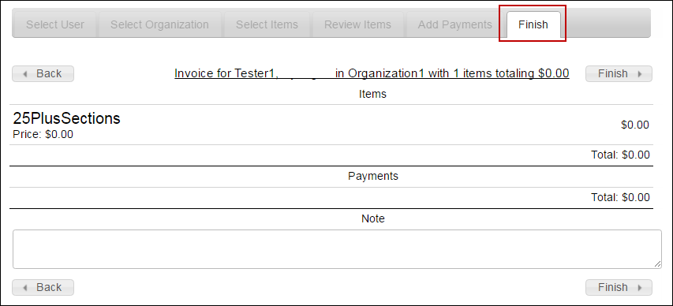

# Create Invoice

Before generating an invoice, first you need to identify a user, select the organization name of the user, select the one or more items (course catalogs), and then add the schedule payment date.

## **To create a new invoice**

<mark style="color:blue;">**Step 1:**</mark>  Click <mark style="color:blue;">**Administration**</mark> <mark style="color:blue;"></mark><mark style="color:blue;">></mark> <mark style="color:blue;"></mark><mark style="color:blue;">**View Invoices**</mark>.

> The **Invoices** page is displayed.

<figure><figcaption></figcaption></figure>

<mark style="color:blue;">**Step 2:**</mark>  On the upper-right corner of the screen, click the <mark style="color:blue;">**Create New Invoice**</mark> link.

> The <mark style="color:blue;">**Select User**</mark> page is displayed, containing the list of users.

<figure><figcaption></figcaption></figure>

<mark style="color:blue;">**Step 3:**</mark>  Select the user for whom the invoice is to be created, and then click <mark style="color:blue;">**Next**</mark>.

> The purchasing user does not have to be the redeeming user. For example, if a school principal bought training and wanted to distribute the codes to his students.
>
> The <mark style="color:blue;">**Select Organization**</mark> page is displayed, containing the list of organizations.

<figure><figcaption></figcaption></figure>


You can search a user in the <mark style="color:blue;">**Search**</mark> box. Alternatively, you can click <mark style="color:blue;">**Create User**</mark> to create a new user (or purchaser) for issuing the invoice.


<mark style="color:blue;">**Step 4:**</mark>  Select the organization, and then click <mark style="color:blue;">**Next**</mark>.

> The <mark style="color:blue;">**Select Items**</mark> page is displayed, containing the list of catalogs for sale.

<figure><figcaption></figcaption></figure>


Only those organizations that have a course catalog for sale are available. Those organizations that do not have a catalog for sale appear dimmed and are unavailable for selection.


<mark style="color:blue;">**Step 5:**</mark>  Select one or more catalogs from the list, and then click <mark style="color:blue;">**Next**</mark>.

> The <mark style="color:blue;">**Review Items**</mark> page is displayed.


Usually, all the sections are included at the time of purchase of a catalog. However, in specific instances, for example, in case of retailers if you need to select specific sections within a catalog, do the following:

* On the <mark style="color:blue;">**Select Items**</mark> page, select the <mark style="color:blue;">**Allow Multiple Items**</mark> <mark style="color:blue;"></mark><mark style="color:blue;"></mark> check box.
* Next to the catalog name, click <mark style="color:blue;">**Browse**</mark>, navigate and select the required sections.
* Click <mark style="color:blue;">**Back**</mark> to see to the catalogs list. The selection of the individual sections or items within the catalog are retained, and the price is reflected above the catalogs list.

_<mark style="color:blue;">In case you change the organization after selecting a catalog or sections within a catalog, your purchases are cleared.</mark>_


<mark style="color:blue;">**Step 6:**</mark>  On the <mark style="color:blue;">**Review Items**</mark> page, review the items selected for purchase.

<figure><figcaption></figcaption></figure>

> You can change the quantity in the box provided, next to the item purchased.

<mark style="color:blue;">**Step 7:**</mark>  Click the  icon, to delete an item purchased. The amount due is automatically refreshed for each such change made in the purchase list. After you have reviewed the purchases list and made the necessary changes, click <mark style="color:blue;">**Next**</mark>.

> The <mark style="color:blue;">**Add Payments**</mark> page is displayed.

<figure><figcaption></figcaption></figure>

<mark style="color:blue;">**Step 8:**</mark>  Click <mark style="color:blue;">**Add Scheduled Payment**</mark>.

The <mark style="color:blue;">**Add Scheduled Payment**</mark> dialog box is displayed.

<figure><figcaption></figcaption></figure>

<mark style="color:blue;">**Step 9:**</mark>  In the <mark style="color:blue;">**Amount $**</mark> box, type the amount (in USD).

<mark style="color:blue;">**Step 10:**</mark>  Click the <mark style="color:blue;">**Due Date**</mark> box, select the due date for the payment.

<mark style="color:blue;">**Step 11:**</mark>  In the <mark style="color:blue;">**Notes**</mark> box, type some relevant information for the scheduled payment.

> The scheduled payment details are displayed on the <mark style="color:blue;">**Add Payments**</mark> page.

<mark style="color:blue;">**Step 12:**</mark>  Click <mark style="color:blue;">**Add**</mark>, and then click <mark style="color:blue;">**Next**</mark>.

> The <mark style="color:blue;">**Finish**</mark> page is displayed. Review the purchase details.

<figure><figcaption></figcaption></figure>


Click **Back** to revisit the previous tabs and make the changes. You can type additional information, in the **Note** area.


<mark style="color:blue;">**Step 13:**</mark>  Click <mark style="color:blue;">**Finish**</mark>.

> The invoice is created and displayed on the <mark style="color:blue;">**Invoices**</mark> page.

#### © NexPort Solutions. All Rights Reserved.
