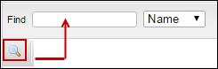

# Invoice Toolbar

#### Primarily, using this tool bar, you can navigate to the displayed invoice.

#### The following table provides a description about the options available in the invoice toolbar.

| Button                                                  | Action or Description                                                                                                                                                            |
| ------------------------------------------------------- | -------------------------------------------------------------------------------------------------------------------------------------------------------------------------------- |
|                   | You can search an invoice based on invoice number, purchaser last name, purchaser first name, purchaser email ID, purchaser login, organization name or organization short name. |
|   | Displays the number of invoices that you can view per page.                                                                                                                      |
|  (1).png>) | You can navigate to the first page of the selected invoice.                                                                                                                      |
|               | You can navigate to the previous page of the selected invoice.                                                                                                                   |
|          | Displays the current page number of the invoice.                                                                                                                                 |
|                   | You can navigate to the next page of the selected invoice.                                                                                                                       |
|  (1).png>)  | You can navigate to the last page of the selected invoice.                                                                                                                       |
| .png>)      | You can refresh the current invoice page.                                                                                                                                        |

#### © NexPort Solutions. All Rights Reserved.
