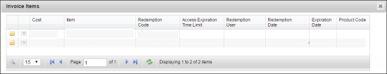
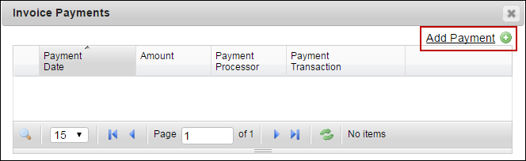
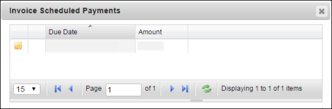
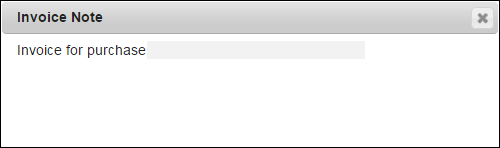
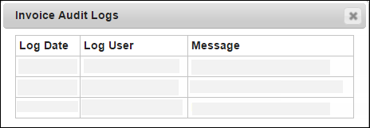

# Manage Invoice Information

## View item details

You can view the invoice items such as the cost, name of the item, redemption code, and invoice item details.

### **To view item details**

<mark style="color:blue;">**Step 1:**</mark> Click <mark style="color:blue;">**Administration**</mark> <mark style="color:blue;">></mark> <mark style="color:blue;">**View Invoices**</mark>.

<mark style="color:blue;">**Step 2:**</mark> The <mark style="color:blue;">**Invoices**</mark> page is displayed.

<mark style="color:blue;">**Step 3:**</mark> Click the  icon.

> The <mark style="color:blue;">**Invoice Items**</mark> dialog box is displayed.

<figure><figcaption></figcaption></figure>

The following table contains description for all the fields that you see in the **Invoice Items** window.

| Field                                                       | Action or Description                                                                                                                                                                              |
| ----------------------------------------------------------- | -------------------------------------------------------------------------------------------------------------------------------------------------------------------------------------------------- |
|      | Click to view the invoice item note.                                                                                                                                                               |
|  | Click to view the invoice item audit logs. The audit log displays a log of all invoice activity for the invoice item.                                                                              |
| Cost                                                        | Displays the price paid for the invoice item expressed in US dollars.                                                                                                                              |
| Redemption Code                                             | This code can be used to redeem the associated invoice item. The invoice item may be a section, training plan, or a catalog. The code can be shared with any user to access the invoice item.      |
| Access Expiration Time Limit                                | Displays the amount of time the user has access to the invoice item after they have redeemed it using the redemption code.                                                                         |
| Redemption User                                             | This field is blank until a user has redeemed the invoice item. After an item is redeemed it is no longer available and the user who redeemed the item is listed under the Redemption User column. |
| Redemption Date                                             | Displays the date when the redemption code was used.                                                                                                                                               |
| Expiration Date                                             | Displays the absolute date that the user no longer has access to the redeemed item. This field is blank till the item is redeemed.                                                                 |
| Product Code                                                | Displays the product code specified when the invoice was created.                                                                                                                                  |

## View and add payment details 

You can view the invoice payment details such as the payment date, payment processor, amount, and invoice payment details. Also, you can add the invoice payment details such as the amount, payment date, payment processor, and others.

### **To view payment details**

<mark style="color:blue;">**Step 1:**</mark> Click <mark style="color:blue;">**Administration**</mark> <mark style="color:blue;">></mark> <mark style="color:blue;">**View Invoices**</mark>.

<mark style="color:blue;">**Step 2:**</mark> The <mark style="color:blue;">**Invoices**</mark> page is displayed.

<mark style="color:blue;">**Step 3:**</mark> Click the  icon.

<mark style="color:blue;">**Step 4:**</mark> The <mark style="color:blue;">**Invoice Payments**</mark> dialog box is displayed.

The following table contains description for all the fields that you see in the <mark style="color:blue;">**Invoice Payments**</mark> window.

| Field                  | Action or Description                                                                                                                                                                                                                 |
| ---------------------- | ------------------------------------------------------------------------------------------------------------------------------------------------------------------------------------------------------------------------------------- |
| Payment Date           | Displays the date when the payment is made.                                                                                                                                                                                           |
| Amount                 | Displays the invoice amount.                                                                                                                                                                                                          |
| Payment Processor      | Displays the name of the payment processing company, (which is a third-party), selected by NexPort (merchant), to handle transactions from various payment modes such as credit cards, debit cards, checks, and others payment modes. |
| Payment Transaction ID | Displays the transaction ID from the remote payment processor.                                                                                                                                                                        |

### **To add payment details:**

<mark style="color:blue;">**Step 1:**</mark> On the <mark style="color:blue;">**Invoices**</mark> tab, click the  icon.

> The <mark style="color:blue;">**Invoice Payments**</mark> dialog box is displayed.

<figure><figcaption></figcaption></figure>

<mark style="color:blue;">**Step 2:**</mark> Click the <mark style="color:blue;">**Add Payment**</mark> link.

## View scheduled payments 

You can view the invoice scheduled payment details. When an invoice entry is created, payables schedules the payment for each invoice based on the payment terms and terms date you enter for the invoice.

### **To view scheduled payment details**

<mark style="color:blue;">**Step 1:**</mark> Click <mark style="color:blue;">**Administration**</mark> <mark style="color:blue;">></mark> <mark style="color:blue;">**View Invoices**</mark>.

> The Invoices page is displayed.

<mark style="color:blue;">**Step 2:**</mark> Click the  icon.

> The <mark style="color:blue;">**Invoice Scheduled Payments**</mark> dialog box is displayed. You can view the invoice scheduled payment note, the date when the amount is due, and the total amount invoiced.

<figure><figcaption></figcaption></figure>

## View a note 

You can view an additional information related to the invoice. The invoice note option lets you add additional contextual notes to the invoices, for clarity.

### **To view a note**

<mark style="color:blue;">**Step 1:**</mark> Click <mark style="color:blue;">**Administration**</mark> <mark style="color:blue;">></mark> <mark style="color:blue;">**View Invoices**</mark>.

> The <mark style="color:blue;">**Invoices**</mark> page is displayed.

<mark style="color:blue;">**Step 2:**</mark> Click the  icon.

> The <mark style="color:blue;">**Invoice Note**</mark> dialog box is displayed, containing the note appended at the time of creating the invoice.

<figure><figcaption></figcaption></figure>

## View audit logs 

You can view the audit logs related to the invoice, such as login date of the invoice, name and email ID of the purchaser, and any message related to the invoice.

### **To view the invoice audit logs**

<mark style="color:blue;">**Step 1:**</mark> Click <mark style="color:blue;">**Administration**</mark> <mark style="color:blue;">></mark> <mark style="color:blue;">**View Invoices**</mark>.

> The <mark style="color:blue;">**Invoices**</mark> page is displayed.

<mark style="color:blue;">**Step 2:**</mark> Click the  icon.

> The <mark style="color:blue;">**Invoice Audit Logs**</mark> window, which contains the audit logs, is displayed.

<figure><figcaption></figcaption></figure>

#### © NexPort Solutions. All Rights Reserved.
