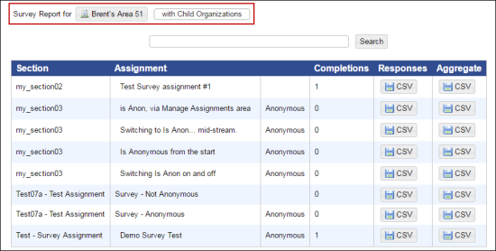
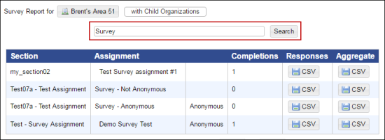
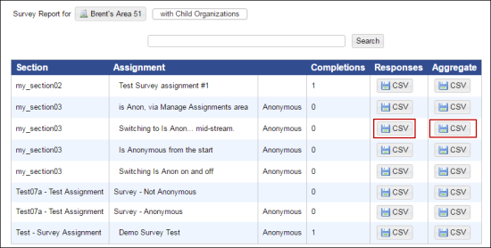

# Survey Reporting

## Survey Reporting 

NexPort Campus offers flexibility to generate a survey report depending on your requirement, thus enabling you to make informed decision. For example, you can generate a survey report for an organization with all the sub-organization (child organization) and groups.

## View and search the survey report 

You can view an existing list of all survey reports of your organization. Also, you can search a survey report.

The survey report displays the section name, assignment name, number of survey completions, response, and aggregate columns. You can view the survey report of an organization with or without the child organization.

### **To view survey reports:**

<mark style="color:blue;">**Step 1:**</mark>  Click <mark style="color:blue;">**Administration**</mark> <mark style="color:blue;"></mark><mark style="color:blue;">></mark> <mark style="color:blue;"></mark><mark style="color:blue;">**Reports**</mark> <mark style="color:blue;"></mark><mark style="color:blue;">></mark> <mark style="color:blue;"></mark><mark style="color:blue;">**Survey Reports**</mark>.

> The <mark style="color:blue;">**Survey Reports**</mark> page is displayed. You can view all the surveys that are assigned to the students of your organization.

<figure><figcaption></figcaption></figure>


In the <mark style="color:blue;">**Survey Report**</mark> for list, click the organization, to view the survey report for a particular organization with or without the child organization.


### **To search a survey report:**

<mark style="color:blue;">**Step 1:**</mark>  Click <mark style="color:blue;">**Administration**</mark> <mark style="color:blue;"></mark><mark style="color:blue;">></mark> <mark style="color:blue;"></mark><mark style="color:blue;">**Reports**</mark> <mark style="color:blue;"></mark><mark style="color:blue;">></mark> <mark style="color:blue;"></mark><mark style="color:blue;">**Survey Reports**</mark>.

> The <mark style="color:blue;">**Survey Reports**</mark> page is displayed.

<mark style="color:blue;">**Step 2:**</mark>  In the <mark style="color:blue;">**Search**</mark> box, type the first few characters of the survey name that you need to search.

> NexPort Campus populates matching results.

<figure><figcaption></figcaption></figure>

## Export a survey report 

You can export the response and aggregate response of the survey report in CSV format for further editing, calculations, or archiving.

### **To export the survey report:**

<mark style="color:blue;">**Step 1:**</mark>  Click <mark style="color:blue;">**Administration**</mark> <mark style="color:blue;"></mark><mark style="color:blue;">></mark> <mark style="color:blue;"></mark><mark style="color:blue;">**Reports**</mark> <mark style="color:blue;"></mark><mark style="color:blue;">></mark> <mark style="color:blue;"></mark><mark style="color:blue;">**Survey Reports**</mark>.

> The <mark style="color:blue;">**Survey Reports**</mark> page is displayed.

<mark style="color:blue;">**Step 2:**</mark> In the <mark style="color:blue;">**Response**</mark> column or <mark style="color:blue;">**Aggregate**</mark> column, click the <mark style="color:blue;">**CSV**</mark> button next to the survey for which you need to export the survey report in CSV format.

<figure><figcaption></figcaption></figure>

#### © NexPort Solutions. All Rights Reserved.
