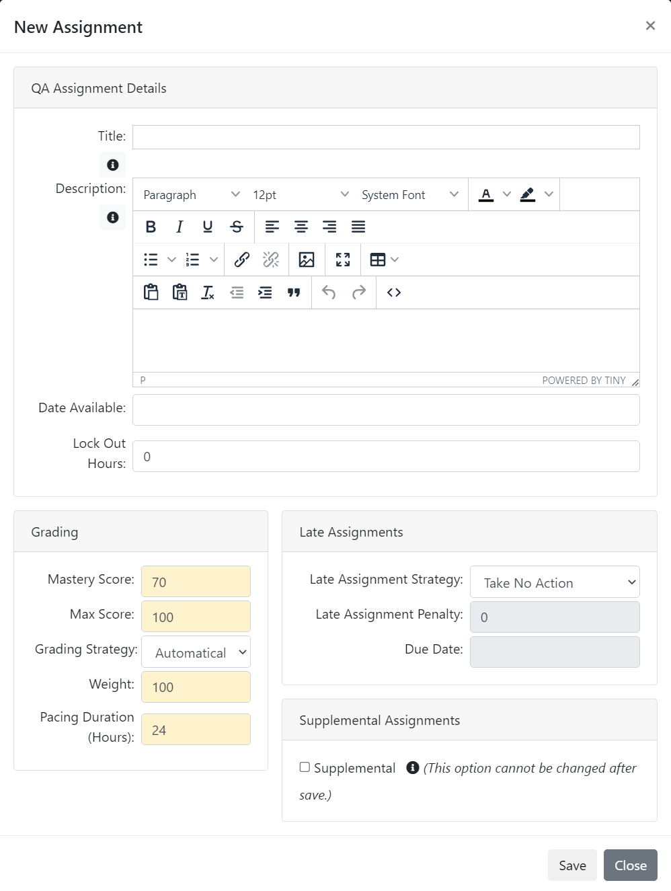

# Quality Assurance Assignment

You are here: [My Training](../../../) > [Instructor](../../) > [Assignment Types](./) > Quality Assurance Assignment

## Quality Assurance Assignment 

The following image illustrates the quality assurance assignment type.

<figure><figcaption></figcaption></figure>

The following table provides explanation for the user inputs that are required for the various sections and fields to manage quality assurance assignment.

| Section                                                      | Field                                                                                                                                                                                                                                                                                                                                                                                                                                                                                                                                                                                                                                                                                                                                                                                                                                                                                                                                                                                                                                                                       | Action or Description                                                                                                                                                                                                                                                                                                                                                                                                                                                                                                    |
| ------------------------------------------------------------ | --------------------------------------------------------------------------------------------------------------------------------------------------------------------------------------------------------------------------------------------------------------------------------------------------------------------------------------------------------------------------------------------------------------------------------------------------------------------------------------------------------------------------------------------------------------------------------------------------------------------------------------------------------------------------------------------------------------------------------------------------------------------------------------------------------------------------------------------------------------------------------------------------------------------------------------------------------------------------------------------------------------------------------------------------------------------------- | ------------------------------------------------------------------------------------------------------------------------------------------------------------------------------------------------------------------------------------------------------------------------------------------------------------------------------------------------------------------------------------------------------------------------------------------------------------------------------------------------------------------------ |
| <mark style="color:blue;">**Assignment Details**</mark>      | **Title**                                                                                                                                                                                                                                                                                                                                                                                                                                                                                                                                                                                                                                                                                                                                                                                                                                                                                                                                                                                                                                                                   | 
In the Rich Text Editor area, type a topic name for the quality assurance assignment. You can apply italic and bold styles to assignment title.

Note:

This is a mandatory field.
                                                                                                                                                                                                                                                                                                                      |
| <mark style="color:blue;">**Description**</mark>             | 
In the Rich Text Editor area, type the quality assurance assignment details.

Note:

In the <strong>Assignment Details</strong> section, click the  icon. The <strong>Assignment Template Reference</strong> page is displayed. Select the required <a href="http://velocity.apache.org/engine/1.6/user-guide.html">Velocity Template Language (VTL)</a> property and copy-paste it in the Rich Text Editor area. If you place the name of a field after a $, it is replaced with the information that field represents. For example, ‘Welcome to $OrganizationName’ changes to ‘Welcome to NexPort’, if the organization name is 'NexPort'.

For more information about adding content and applying formatting to the content in the Rich Text Editor area, see <a href="https://www.nexportcampus.com/Content/Guides/aweb/Content/Get_Started/Use_the_Rich_Text_Editor.htm">Use the Rich Text Editor</a>.
 |                                                                                                                                                                                                                                                                                                                                                                                                                                                                                                                          |
| <mark style="color:blue;">**Date Available**</mark>          | In the **Date Available** box, enter the available assignment date and time in MM/DD/YYYY, HH:MM format with time zone. By default, the current date appears as the available assignment date. You can select the current date or any future date as an available assignment date.                                                                                                                                                                                                                                                                                                                                                                                                                                                                                                                                                                                                                                                                                                                                                                                          |                                                                                                                                                                                                                                                                                                                                                                                                                                                                                                                          |
| <mark style="color:blue;">**Lock Out Hours**</mark>          | In the **Lock Out Hours** box, enter a specific number (in hours) to lock out the period an assignment for the student.                                                                                                                                                                                                                                                                                                                                                                                                                                                                                                                                                                                                                                                                                                                                                                                                                                                                                                                                                     |                                                                                                                                                                                                                                                                                                                                                                                                                                                                                                                          |
| <mark style="color:blue;">**Grading**</mark>                 | **Mastery Score**                                                                                                                                                                                                                                                                                                                                                                                                                                                                                                                                                                                                                                                                                                                                                                                                                                                                                                                                                                                                                                                           | 
Type a numerical value to set the mastery score. The mastery score indicates the minimum score to pass the Courseware assignment. For example, type a mastery score of 70 to indicate a 70 per cent is the passing mark for the Courseware assignment.

If you do not define a mastery score, NexPort Campus automatically calculates the points scored, but marks the student's Test assignment attempt as completed.

Note:

This is a mandatory field.
                                          |
| <mark style="color:blue;">**Max Score**</mark>               | 
The maximum score that the quality assurance assignment returns. The max score value is used to calculate a normalized score for the assignment.

Note:

This is a mandatory field.
                                                                                                                                                                                                                                                                                                                                                                                                                                                                                                                                                                                                                                                                                                                                                                                                                                                                        |                                                                                                                                                                                                                                                                                                                                                                                                                                                                                                                          |
| <mark style="color:blue;">**Grading Strategy**</mark>        | 
Determines whether a grade must be given by the Instructor, NexPort automatically assign a grade or no grade is recorded.

Note:

If ‘No Grade’ is selected for an assignment then the score is displayed as -/- in the Gradebook view for those assignments.
                                                                                                                                                                                                                                                                                                                                                                                                                                                                                                                                                                                                                                                                                                                                                                                              |                                                                                                                                                                                                                                                                                                                                                                                                                                                                                                                          |
| <mark style="color:blue;">**Weight**</mark>                  | 
Used to calculate the final section score, this is the relative weight to give this assignment in relation to the other assignment weights within the section.

Note:

This is a mandatory field.
                                                                                                                                                                                                                                                                                                                                                                                                                                                                                                                                                                                                                                                                                                                                                                                                                                                          |                                                                                                                                                                                                                                                                                                                                                                                                                                                                                                                          |
| <mark style="color:blue;">**Pacing Duration (Hours)**</mark> | 
Virtual hours that can be used to control the percentage complete that is calculated in NexPort. If all assignments are set to 1 then the pacing is set across the assignments.

Note:

This is a mandatory field.
                                                                                                                                                                                                                                                                                                                                                                                                                                                                                                                                                                                                                                                                                                                                                                                                                                         |                                                                                                                                                                                                                                                                                                                                                                                                                                                                                                                          |
| <mark style="color:blue;">**Late Assignment**</mark>         | **Late Assignment Strategy**                                                                                                                                                                                                                                                                                                                                                                                                                                                                                                                                                                                                                                                                                                                                                                                                                                                                                                                                                                                                                                                | 
In the <strong>Late Assignment Strategy</strong> list, enter one of the following:
<ul><li><strong>FailAfterDueDate:</strong> If selected then the assignment is marked as failed as soon as the assignment due date is passed.</li><li>or</li><li><strong>ApplyPenalty:</strong> If selected, NexPort subtracts the number of points from a late assignment.</li><li>or</li><li><strong>TakeNoAction (default):</strong> If selected, the student is not penalized for passing the assignment due date.</li></ul> |
| <mark style="color:blue;">**Late Assignment Penalty**</mark> | 
In the <strong>Last Assignment Penalty</strong> box, type the points to subtract if the assignment is not complete by the due date. This only applies if the <strong>Apply Penalty</strong> option is selected.

Note:

This is a mandatory field.
                                                                                                                                                                                                                                                                                                                                                                                                                                                                                                                                                                                                                                                                                                                                                                                                         |                                                                                                                                                                                                                                                                                                                                                                                                                                                                                                                          |
| <mark style="color:blue;">**Due Date**</mark>                | 
In the <strong>Due Date</strong> box, enter due date and time of the assignment in MM/DD/YYYY, HH:MM format with time zone. By default, the current date appears as the due date. You can select the current date or any future date as a due date.

In Gradebook, the student’s assignment is marked as late, if the student completes the assignment after the due date.

Note:

The <strong>Due Date</strong> box is enabled, when you enter FailAfterDueDate in the <strong>Late Assignment Strategy</strong> list.
                                                                                                                                                                                                                                                                                                                                                                                                                                                                                                                               |                                                                                                                                                                                                                                                                                                                                                                                                                                                                                                                          |
| <mark style="color:blue;">**Supplemental Assignment**</mark> | When an assignment is marked as supplemental, it will be hidden to students **unless** you assign it to them. This can be useful when an assignment should only be assigned as needed.                                                                                                                                                                                                                                                                                                                                                                                                                                                                                                                                                                                                                                                                                                                                                                                                                                                                                      | **Note: Marking an assignment as supplemental is a **_**permanent**_** change.**                                                                                                                                                                                                                                                                                                                                                                                                                                         |

