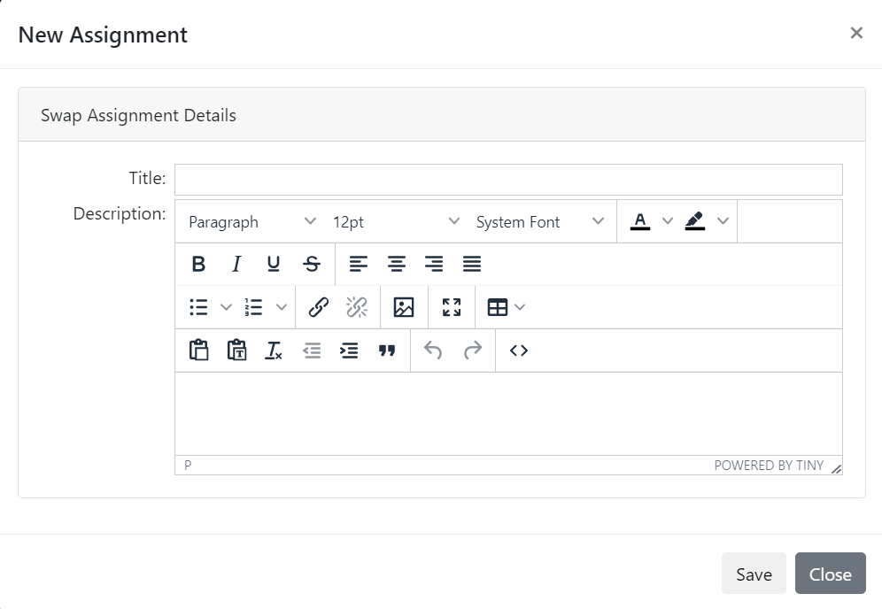

# Swappable Assignment

You are here: [My Training](../../../) > [Instructor](../../) > [Assignment Types](./) > Swappable Assignment

### Swappable assignment 

The following image illustrates the swappable assignment type.

<figure><figcaption></figcaption></figure>

The following table provides explanation for the user inputs that are required for the various sections and fields to manage swappable assignment.

| Section                                                 | Field                                                                                                                                                                                                                                                                                                                                                                                                                                                                                                                                                                                                                                                                                                                                                                                                                                                                                                                                                                                                                                                                               | Action or Description                                                                                                                                                                  |
| ------------------------------------------------------- | ----------------------------------------------------------------------------------------------------------------------------------------------------------------------------------------------------------------------------------------------------------------------------------------------------------------------------------------------------------------------------------------------------------------------------------------------------------------------------------------------------------------------------------------------------------------------------------------------------------------------------------------------------------------------------------------------------------------------------------------------------------------------------------------------------------------------------------------------------------------------------------------------------------------------------------------------------------------------------------------------------------------------------------------------------------------------------------- | -------------------------------------------------------------------------------------------------------------------------------------------------------------------------------------- |
| <mark style="color:blue;">**Assignment Details**</mark> | **Title**                                                                                                                                                                                                                                                                                                                                                                                                                                                                                                                                                                                                                                                                                                                                                                                                                                                                                                                                                                                                                                                                           | 
In the Rich Text Editor area, type a title for the swappable assignment. You can apply italic and bold styles to assignment title.

Note:

This is a mandatory field.
 |
| <mark style="color:blue;">**Description**</mark>        | 
In the Rich Text Editor area, type description related to the swappable assignment.

Note:

In the <strong>Swappable Assignment</strong>section, click the  icon. The <strong>Assignment Template Reference</strong> page is displayed. Select the required <a href="http://velocity.apache.org/engine/1.6/user-guide.html">Velocity Template Language (VTL)</a> property and copy-paste it in the Rich Text Editor area. If you place the name of a field after a $, it is replaced with the information that field represents. For example, ‘Welcome to $OrganizationName’ changes to ‘Welcome to NexPort’, if the organization name is 'NexPort'.

For more information about adding content and applying formatting to the content in the Rich Text Editor area, see <a href="https://www.nexportcampus.com/Content/Guides/aweb/Content/Get_Started/Use_the_Rich_Text_Editor.htm">Use the Rich Text Editor</a>.
 |                                                                                                                                                                                        |

