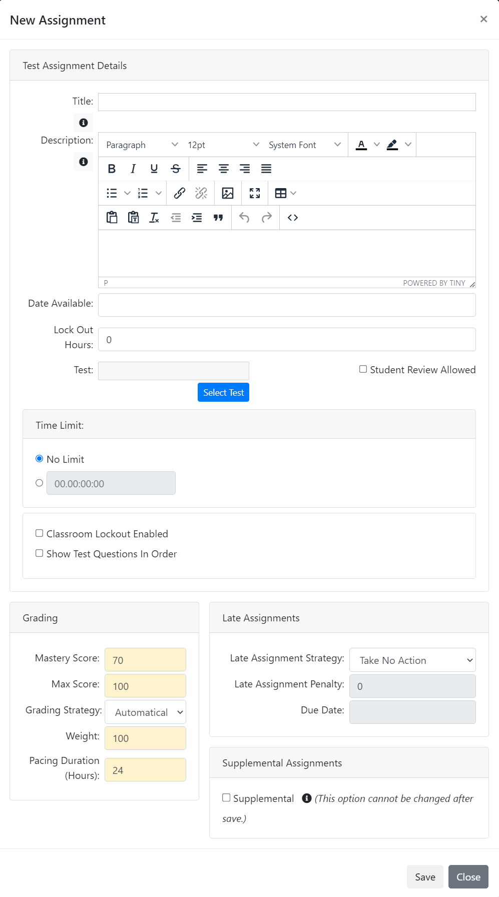

# Test Assignment

You are here: [My Training](../../../) > [Instructor](../../) > [Assignment Types](./) > Test Assignment

### Test assignment 

The test assignments can be set as either graded or ungraded assignments. Test questions are always randomized by default. You can restrict the time a student has to take a test with assessment time limits or set test time limits with a live countdown on the test interface page. You can also allow multiple attempts to give the students the opportunity to re-take tests. You can also allow unlimited test attempts or set a maximum attempt limit.

The following image illustrates the test assignment type.

<figure><figcaption></figcaption></figure>

The following table provides explanation for the user inputs that are required for the various sections and fields to manage test assignment.

| Section                                                           | Field                                                                                                                                                                                                                                                                                                                                                                                                                                                                                                                                                                                                                                                                                                                                                                                                                                                                                                                                                                                                                                                                        | Action or Description                                                                                                                                                                                                                                                                                                                                                                                                                                                                                                    |
| ----------------------------------------------------------------- | ---------------------------------------------------------------------------------------------------------------------------------------------------------------------------------------------------------------------------------------------------------------------------------------------------------------------------------------------------------------------------------------------------------------------------------------------------------------------------------------------------------------------------------------------------------------------------------------------------------------------------------------------------------------------------------------------------------------------------------------------------------------------------------------------------------------------------------------------------------------------------------------------------------------------------------------------------------------------------------------------------------------------------------------------------------------------------- | ------------------------------------------------------------------------------------------------------------------------------------------------------------------------------------------------------------------------------------------------------------------------------------------------------------------------------------------------------------------------------------------------------------------------------------------------------------------------------------------------------------------------ |
| <mark style="color:blue;">**Assignment Details**</mark>           | **Title**                                                                                                                                                                                                                                                                                                                                                                                                                                                                                                                                                                                                                                                                                                                                                                                                                                                                                                                                                                                                                                                                    | 
In the Rich Text Editor area, type a title for the test assignment. You can apply italic and bold styles to assignment title.

Note:

This is a mandatory field.
                                                                                                                                                                                                                                                                                                                                        |
| <mark style="color:blue;">**Description**</mark>                  | 
In the Rich Text Editor area, type description related to the test assignment.

Note:

In the <strong>Assignment Details</strong>section, click the  icon. The <strong>Assignment Template Reference</strong> page is displayed. Select the required <a href="http://velocity.apache.org/engine/1.6/user-guide.html">Velocity Template Language (VTL)</a> property and copy-paste it in the Rich Text Editor area. If you place the name of a field after a $, it is replaced with the information that field represents. For example, ‘Welcome to $OrganizationName’ changes to ‘Welcome to NexPort’, if the organization name is 'NexPort'.

For more information about adding content and applying formatting to the content in the Rich Text Editor area, see <a href="https://www.nexportcampus.com/Content/Guides/aweb/Content/Get_Started/Use_the_Rich_Text_Editor.htm">Use the Rich Text Editor</a>.
 |                                                                                                                                                                                                                                                                                                                                                                                                                                                                                                                          |
| <mark style="color:blue;">**Test**</mark>                         | 
<strong>To upload a test:</strong>
<ol><li>Click <strong>Select Test</strong>.</li><li>The <strong>Find Test</strong> dialog box is displayed.</li><li>Click <strong>Select</strong> link next to the test that you need to add as a test assignment.</li><li>Note:</li><li>To search a test, in the <strong>Search</strong> box, type first few characters of the test that you need to search, and then click <strong>Search</strong>.</li></ol>                                                                                                                                                                                                                                                                                                                                                                                                                                                                                                                                                                                                                     |                                                                                                                                                                                                                                                                                                                                                                                                                                                                                                                          |
| <mark style="color:blue;">**Student review Allowed**</mark>       | Select the **Allowed** check box, to allow students to review their test assignment responses and the correct answers.                                                                                                                                                                                                                                                                                                                                                                                                                                                                                                                                                                                                                                                                                                                                                                                                                                                                                                                                                       |                                                                                                                                                                                                                                                                                                                                                                                                                                                                                                                          |
| <mark style="color:blue;">**Attempt Limit**</mark>                | 
In the <strong>Attempt Limit</strong> area, do on of the following:
<ul><li>Click <strong>Unlimited Attempts</strong>.</li><li>No attempt limit is set for the students to attempt an assignment.</li><li>or</li><li>Click and in the box, type a numerical value to set the number of attempts allowed for the students to attempt an assignment.</li></ul>                                                                                                                                                                                                                                                                                                                                                                                                                                                                                                                                                                                                                                                                                                           |                                                                                                                                                                                                                                                                                                                                                                                                                                                                                                                          |
| <mark style="color:blue;">**Time Limit**</mark>                   | 
In the <strong>Time Limit</strong> area, do on of the following:
<ul><li>Click <strong>No Limit</strong>.</li><li>No time frame is set for students to complete the assignment.</li><li>or</li><li>Click and in the <strong>hrs</strong> box and <strong>min</strong> box, type specified hours and minutes in which students must complete the assignment.</li><li>Note:</li><li>The test cannot exceed 23 hours and 59 minutes. You must include both hours and minutes. The hour can be set at 0, but there must be a numeric value in the text box provided.</li></ul>                                                                                                                                                                                                                                                                                                                                                                                                                                                                                             |                                                                                                                                                                                                                                                                                                                                                                                                                                                                                                                          |
| <mark style="color:blue;">**Waiting Period**</mark>               | 
Waiting periods allow you to specify a different period of time that must pass between subsequent test attempts.

For instance you can specify that the student must:
<ul><li>Wait one day between attempt one and attempt two</li><li>Wait three days between attempt two and attempt three</li><li>Wait one day between attempt three and attempt four</li><li>and so on</li></ul>                                                                                                                                                                                                                                                                                                                                                                                                                                                                                                                                                                                                                                                                              |                                                                                                                                                                                                                                                                                                                                                                                                                                                                                                                          |
| <mark style="color:blue;">**Date Available**</mark>               | In the **Date Available** box, enter the available assignment date and time in MM/DD/YYYY, HH:MM format with time zone. By default, the current date appears as the available assignment date. You can select the current date or any future date as an available assignment date.                                                                                                                                                                                                                                                                                                                                                                                                                                                                                                                                                                                                                                                                                                                                                                                           |                                                                                                                                                                                                                                                                                                                                                                                                                                                                                                                          |
| <mark style="color:blue;">**Classroom Lockout Enabled**</mark>    | Select the **Classroom Lockout Enabled** check box, the student gets locked out of the classroom materials while they are taking the test.                                                                                                                                                                                                                                                                                                                                                                                                                                                                                                                                                                                                                                                                                                                                                                                                                                                                                                                                   |                                                                                                                                                                                                                                                                                                                                                                                                                                                                                                                          |
| <mark style="color:blue;">**Lock Out Hours**</mark>               | In the **Lock Out Hours** box, enter a specific number (in hours) to lock out the period an assignment for the student.                                                                                                                                                                                                                                                                                                                                                                                                                                                                                                                                                                                                                                                                                                                                                                                                                                                                                                                                                      |                                                                                                                                                                                                                                                                                                                                                                                                                                                                                                                          |
| <mark style="color:blue;">**Show Test Questions In Order**</mark> | Select the **Show Test Questions In Order** check box, forces NexPort to use the ordering specified in the question banks and test definition. By default NexPort randomize the test question ordering each time a test is launched.                                                                                                                                                                                                                                                                                                                                                                                                                                                                                                                                                                                                                                                                                                                                                                                                                                         |                                                                                                                                                                                                                                                                                                                                                                                                                                                                                                                          |
| <mark style="color:blue;">**Grading**</mark>                      | **Mastery Score**                                                                                                                                                                                                                                                                                                                                                                                                                                                                                                                                                                                                                                                                                                                                                                                                                                                                                                                                                                                                                                                            | 
Type a numerical value to set the mastery score. The mastery score indicates the minimum score to pass the Courseware assignment. For example, type a mastery score of 70 to indicate a 70 per cent is the passing mark for the Courseware assignment.

If you do not define a mastery score, NexPort Campus automatically calculates the points scored, but marks the student's Test assignment attempt as completed.

Note:

This is a mandatory field.
                                          |
| <mark style="color:blue;">**Max Score**</mark>                    | 
The maximum score that the test assignment returns. The max score value is used to calculate a normalized score for the assignment.

Note:

This is a mandatory field.
                                                                                                                                                                                                                                                                                                                                                                                                                                                                                                                                                                                                                                                                                                                                                                                                                                                                                      |                                                                                                                                                                                                                                                                                                                                                                                                                                                                                                                          |
| <mark style="color:blue;">**Grading Strategy**</mark>             | 
Determines whether a grade must be given by the Instructor, NexPort automatically assign a grade or no grade is recorded.

Note:

If ‘No Grade’ is selected for an assignment then the score is displayed as -/- in the Gradebook view for those assignments.
                                                                                                                                                                                                                                                                                                                                                                                                                                                                                                                                                                                                                                                                                                                                                                                               |                                                                                                                                                                                                                                                                                                                                                                                                                                                                                                                          |
| <mark style="color:blue;">**Weight**</mark>                       | Used to calculate the final section score, this is the relative weight to give this assignment in relation to the other assignment weights within the section.                                                                                                                                                                                                                                                                                                                                                                                                                                                                                                                                                                                                                                                                                                                                                                                                                                                                                                               |                                                                                                                                                                                                                                                                                                                                                                                                                                                                                                                          |
| <mark style="color:blue;">**Pacing Duration (Hours)**</mark>      | 
Virtual hours that can be used to control the percentage complete that is calculated in NexPort. If all assignments are set to 1 then the pacing is set across the assignments.

Note:

This is a mandatory field.
                                                                                                                                                                                                                                                                                                                                                                                                                                                                                                                                                                                                                                                                                                                                                                                                                                          |                                                                                                                                                                                                                                                                                                                                                                                                                                                                                                                          |
| <mark style="color:blue;">**Late Assignment**</mark>              | **Late Assignment Strategy**                                                                                                                                                                                                                                                                                                                                                                                                                                                                                                                                                                                                                                                                                                                                                                                                                                                                                                                                                                                                                                                 | 
In the <strong>Late Assignment Strategy</strong> list, enter one of the following:
<ul><li><strong>FailAfterDueDate:</strong> If selected then the assignment is marked as failed as soon as the assignment due date is passed.</li><li>or</li><li><strong>ApplyPenalty:</strong> If selected, NexPort subtracts the number of points from a late assignment.</li><li>or</li><li><strong>TakeNoAction (default):</strong> If selected, the student is not penalized for passing the assignment due date.</li></ul> |
| <mark style="color:blue;">**Late Assignment Penalty**</mark>      | 
In the <strong>Last Assignment Penalty</strong> box, type the points to subtract if the assignment is not complete by the due date. This only applies if the <strong>Apply Penalty</strong> option is selected.

Note:

This is a mandatory field.
                                                                                                                                                                                                                                                                                                                                                                                                                                                                                                                                                                                                                                                                                                                                                                                                          |                                                                                                                                                                                                                                                                                                                                                                                                                                                                                                                          |
| <mark style="color:blue;">**Due Date**</mark>                     | 
In the <strong>Due Date</strong> box, enter due date and time of the assignment in MM/DD/YYYY, HH:MM format with time zone. By default, the current date appears as the due date. You can select the current date or any future date as a due date.

In Gradebook, the student’s assignment is marked as late, if the student completes the assignment after the due date.

Note:

The <strong>Due Date</strong> box is enabled, when you enter FailAfterDueDate in the <strong>Late Assignment Strategy</strong> list.
                                                                                                                                                                                                                                                                                                                                                                                                                                                                                                                                |                                                                                                                                                                                                                                                                                                                                                                                                                                                                                                                          |
| <mark style="color:blue;">**Supplemental Assignment**</mark>      | When an assignment is marked as supplemental, it will be hidden to students **unless** you assign it to them. This can be useful when an assignment should only be assigned as needed.                                                                                                                                                                                                                                                                                                                                                                                                                                                                                                                                                                                                                                                                                                                                                                                                                                                                                       | **Note: Marking an assignment as supplemental is a **_**permanent**_** change.**                                                                                                                                                                                                                                                                                                                                                                                                                                         |

