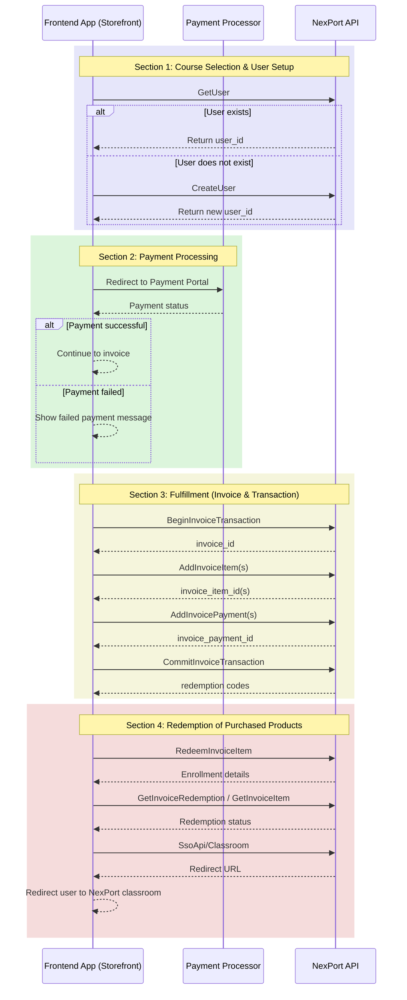

# NexPort Point of Sale (PoS) Workflow

This workflow describes how a partner **frontend application** (any e-commerce site, LMS portal, or marketplace capable of displaying a storefront and processing payments) integrates with the NexPort PoS API to process course purchases, payments, and redemptions.

***

### Flowchart

***

### Section 1: Course Selection & User Setup

#### 1. User Selects Courses

* In a **frontend store** (any e-commerce or LMS portal), the user browses and selects course(s) to purchase.

#### 2. Identify or Create User

* The **frontend app must always call `AdminApi/GetUser`** to check if the user already exists in NexPort.
  * This ensures the store can create whatever mapping is needed to sync the NexPort account with its own user record.
* **If the user does not exist:**
  * Collect basic info (name, email, org).
  * Call `AdminApi/CreateUser` to create and return a `user_id`.
* **If the user exists:**
  * Use the returned `user_id` and subscription context for invoice creation.

***

### Section 2: Payment Processing

#### 3. Process Payment

* The **frontend app** redirects the user to its **Payment Portal** or embedded checkout flow.
* Payment is processed using the app’s **Payment Processor** (e.g., PayPal, Stripe).
* If payment fails → show **Failed Payment Message**.
* If payment succeeds → continue.

***

### Section 3: Fulfillment (Invoice & Transaction)

#### 4. Begin Invoice Transaction

* The **frontend app** calls `POST /PointOfSaleApi/BeginInvoiceTransaction`.
* Required:
  * `purchasing_agent_id` (the buyer)
  * `organization_id` (the selling org)
* Optional: `note` or `purchasing_group_id`
* Response returns an `invoice_id`.

#### 5. Add Invoice Items

* For each product/course selected in the **frontend store**:
  * Call `POST /PointOfSaleApi/AddInvoiceItem` (or `AddInvoiceItems` for bulk).
  * Provide `invoice_id`, `product_id`, `cost`, and any enrollment options.
* Repeat until all items are added.

#### 6. Add Payments

* The **frontend app** calls `POST /PointOfSaleApi/AddInvoicePayment` to record the completed payment transaction.
* Required: `invoice_id`, `payee_id`, `amount_usd`, and payment processor details.
* (Optional) Use `AddInvoiceScheduledPayment` for installments.

#### 7. Commit Invoice Transaction

* The **frontend app** calls `POST /PointOfSaleApi/CommitInvoiceTransaction` with `invoice_id`.
* Response returns:
  * `invoice_redemption_code`
  * `invoice_item_redemption_codes` (per item)

***

### Section 4: Redemption of Purchased Products

#### 8. Redeem Invoice Items

* For each purchased item:
  * The **frontend app** calls `POST /PointOfSaleApi/RedeemInvoiceItem`.
  * Provide `invoice_item_id`, `redeeming_user_id`, and optional `redemption_action_type`.
* Response includes enrollment or catalog subscription details.

#### 9. Check Status

* The **frontend app** can use `GetInvoiceRedemption` or `GetInvoiceItem` to confirm redemption success.
* If failed, handle error or retry if appropriate.
* If successful, continue.

#### 10. Redirect to Classroom

* The **frontend app** calls `POST /SsoApi/Classroom` with the `enrollment_id`.
* Redirect the student’s browser to the returned `url`.
* NexPort auto-logs the student in and opens the classroom.

***

## End-to-End Summary

1. **Course Selection & User Setup** – steps 1–2.
2. **Payment Processing** – step 3.
3. **Fulfillment (Invoice & Transaction)** – steps 4–7.
4. **Redemption of Purchased Products** – steps 8–10.
