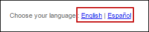

# Language Preferences

English is the default language for NexPort Campus. You can choose to view the NexPort Campus interface in the Spanish language.


_<mark style="color:red;">Setting the preferred language only affects the NexPort Campus interface and not the course content.</mark>_


## **To set the interface language:**

> In the lower-left corner of the NexPort Campus, in the <mark style="color:blue;">**Choose your language**</mark> <mark style="color:blue;"></mark><mark style="color:blue;"></mark> section, click the link of the preferred interface language.

#### © NexPort Solutions. All Rights Reserved.
